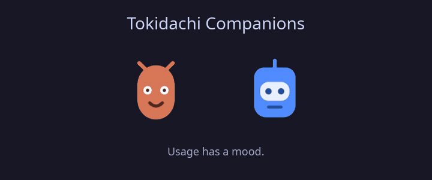

# Tokidachi

This repository is the Linux/GNOME component of Tokidachi. It owns the
platform-neutral Java collector, its versioned JSON contract, and the Linux
host. The native macOS and Windows hosts consume that contract without
reimplementing provider or credential parsing.

### Tokidachi components

| Component | Scope | Repository / downloads |
| --- | --- | --- |
| Collector + Linux host | Java collector and GNOME Shell widget | [tokidachi](https://github.com/Gaalbu/tokidachi) · [Linux releases](https://github.com/Gaalbu/tokidachi/releases) |
| macOS host | Swift/AppKit/SwiftUI menu bar app | [tokidachiMac](https://github.com/Gaalbu/tokidachiMac) · _macOS releases: TBD_ |
| Windows host | WinUI 3/.NET tray app | [tokidachiWin](https://github.com/Gaalbu/tokidachiWin) · _Windows releases: TBD_ |

Rendering fixtures are available in [`fixtures/collector`](fixtures/collector/)
for both native hosts to test against before a live collector is available.

A quiet GNOME Shell widget that shows Claude Code and Codex usage windows on
Ubuntu. Providers are independent and only configured providers are
displayed.

The widget has no taskbar icon and never appears in the window switcher or
Overview. It stays below application windows, including maximized ones, and
remains interactive when the desktop is visible. It supports GNOME 45–48 and
targets Ubuntu 24.04 LTS. Unlike
earlier releases, it is a normal interactive Shell element (not a
click-through background layer): you can minimize it, drag it, resize it,
and pick a theme, all with the mouse.


> [!IMPORTANT]
> Tokidachi replaces the former AI Usage Widget name and uses the new GNOME
> extension UUID `tokidachi@gaalbu.github.io`. Existing installations need a
> one-time manual migration. Follow [MIGRATION.md](docs/MIGRATION.md) before
> installing this release.



### Tokidachi Companions

The provider mascots are the widget's signature: one coherent family of
original, local-only characters whose mood makes quota pressure visible at a
glance. They stay calm during normal use, become restless above 80%, and call
attention to authentication or collector errors. Motion can be disabled
without hiding them.

## What it shows

- Claude's 5-hour and 7-day utilization, plus reset times when available.
- Every limit window returned by the official Codex app-server, including
  multiple metered buckets and individual spend controls.
- Codex limit-state warnings and available rate-limit resets when reported.
- Independent provider state: Claude can fail without affecting Codex, and
  vice versa.
- Only providers that are actually configured. If neither is configured, the
  card remains hidden.
- A small local mascot for each provider. Its motion reflects normal, high-use,
  and attention states and stops while the widget is minimized.
- An interface in English or Brazilian Portuguese. By default, Tokidachi
  follows the GNOME system language and falls back to English for unsupported
  locales.

The collector registry and widget rendering support any number of providers,
but this release has quota integrations for Claude Code and Codex only.
Gemini CLI is intentionally not included: its official documentation exposes
quota in the interactive [`/stats model`](https://github.com/google-gemini/gemini-cli/blob/main/docs/reference/commands.md#stats)
view, but does not document a stable headless command or public quota API that
the collector can safely consume. DeepSeek is also excluded because its API is
[usage-priced and balance-based](https://api-docs.deepseek.com/api/get-user-balance/),
not a subscription window comparable to the 5-hour/7-day bars shown here.

The widget refreshes every five minutes by default. A sanitized usage-only
cache is kept for up to 30 minutes so a temporary failure does not blank a
previously working provider.

## Requirements

For the prebuilt Linux release:

- Ubuntu 24.04 LTS or another x86-64 Linux distribution with GNOME 45–48.
- At least one supported provider:
  - Claude Code logged in with OAuth: `claude auth login`; or
  - Codex CLI installed and logged in with ChatGPT: `codex login`.

Java and Python are not required by the prebuilt release. API-key Claude
accounts do not expose a subscription utilization bar; use Claude Code's
`/cost` command for per-session API spend instead.

## Install - copy and paste once

First, make sure Claude Code or Codex is already logged in. Then copy and
paste this entire block into a terminal; it downloads the latest release,
installs the native collector, and enables the extension:

```bash
set -euo pipefail
UUID='tokidachi@gaalbu.github.io'
ARCHIVE="$(mktemp --suffix=.tar.gz)"
INSTALL_DIR="$(mktemp -d)"
trap 'rm -f "$ARCHIVE"; rm -rf "$INSTALL_DIR"' EXIT

URL='https://github.com/Gaalbu/tokidachi/releases/latest/download/tokidachi-linux-x86_64.tar.gz'
if command -v curl >/dev/null 2>&1; then
    curl --fail --location --show-error "$URL" --output "$ARCHIVE"
elif command -v wget >/dev/null 2>&1; then
    wget --output-document="$ARCHIVE" "$URL"
else
    echo 'Install curl or wget and run this block again.' >&2
    exit 1
fi

tar -xzf "$ARCHIVE" -C "$INSTALL_DIR"
"$INSTALL_DIR/scripts/install.sh"

if ! gnome-extensions enable "$UUID" 2>/dev/null; then
    CURRENT="$(gsettings get org.gnome.shell enabled-extensions)"
    if [[ "$CURRENT" != *"'$UUID'"* ]]; then
        if [[ "$CURRENT" == '[]' || "$CURRENT" == '@as []' ]]; then
            NEXT="['$UUID']"
        else
            NEXT="${CURRENT%]}, '$UUID']"
        fi
        gsettings set org.gnome.shell enabled-extensions "$NEXT"
    fi
    echo 'Installation complete. Log out and back in once to show the widget.'
else
    echo 'Installation complete. The widget is enabled.'
fi
```

On GNOME Wayland, the first installation may require logging out and back in.
The block already leaves the extension enabled, so no second command is
needed. Java and Python do not need to be installed.

To remove it:

```bash
UUID='tokidachi@gaalbu.github.io'
DEST="${XDG_DATA_HOME:-$HOME/.local/share}/gnome-shell/extensions/$UUID"
gnome-extensions disable "$UUID" 2>/dev/null || true
gio trash "$DEST"
```

The uninstaller moves the extension to the user trash instead of deleting it
permanently.

## Build and install from source

Source builds require Maven, a GraalVM JDK 21 or newer distribution with Native Image,
Node.js for the JavaScript syntax check, and `zip` for release packaging.

```bash
git clone https://github.com/Gaalbu/tokidachi.git
cd tokidachi
make test
make native
./scripts/install.sh
```

Build outputs:

- `mvn package` creates the executable
  `target/tokidachi-0.3.1-all.jar`.
- `mvn -Pnative package` creates `target/tokidachi`, the standalone
  Linux executable used by the extension.
- `make package` creates the installable archives under `dist/`.

The JAR is useful for development and diagnostics:

```bash
java -jar target/tokidachi-0.3.1-all.jar --pretty
```

## Interact and customize

No config-file editing is required for day-to-day use:

- **Drag** the header to move the widget anywhere on any monitor. Position is
  saved automatically.
- **Scroll** over the card to resize it (`scaleStep` per notch, clamped
  between `minScale` and `maxScale`).
- Click the **minimize** button (top-right of the header) to collapse the
  widget to a small pill; click the pill to restore it.
- **Right-click** the card to open a small menu: cycle the theme
  (Dark → Light → Glass), choose the interface language (System → English →
  Portuguese (Brazil)), reset position and size, or force an immediate refresh.

Theme, language, and minimized state persist across restarts in
`~/.config/tokidachi/`. Layout (position, monitor, scale) is saved
separately in `layout.json` in the same directory.

Changing the language updates the visible interface and accessibility labels
immediately. Tokidachi translates its own controls and status text; provider
names, quota-window labels, and collector error messages keep the wording
returned by their source.

For defaults applied before any interaction has happened, edit `config.json`
in the installed extension directory:

```text
~/.local/share/gnome-shell/extensions/tokidachi@gaalbu.github.io/config.json
```

Available values:

```json
{
  "refreshSeconds": 300,
  "position": "top-right",
  "margin": 28,
  "scale": 1,
  "minScale": 0.65,
  "maxScale": 1.75,
  "scaleStep": 0.1,
  "language": "auto",
  "theme": "dark",
  "petAnimations": true
}
```

`position` accepts `top-right`, `top-left`, `bottom-right`, or `bottom-left`,
and only applies until the widget is first dragged. `theme` accepts `dark`,
`light`, or `glass`. `language` accepts `auto`, `en`, or `pt-BR`; a language
chosen from the widget menu overrides this default and is saved in `state.json`.
Set `petAnimations` to `false` to disable all mascot motion; the pets remain
visible as static icons. Disable and re-enable the extension after changing the
file.

## Collector architecture and privacy

The collector is a small Java 21 application without Spring Boot. It uses
Jackson's tree model to preserve the JSON contract consumed by `extension.js`:

```json
{
  "version": 1,
  "updatedAt": 2000000000,
  "providers": {
    "claude": {
      "displayName": "Claude",
      "color": "#d97757",
      "pet": "pets/claude.svg",
      "status": "ok",
      "configured": true,
      "windows": [],
      "notices": []
    }
  }
}
```

`displayName`, `color`, `pet`, and `notices` are additive presentation
metadata. The protocol remains at version 1 because existing fields and
provider payloads retain their shape; older consumers can ignore the new
fields. Provider order comes from the registry in `ProviderRegistry.java`, and
the extension creates sections and dividers directly from the keys returned in
`providers`.

Mascot SVGs ship inside the extension and are never downloaded at runtime.
They use original abstract shapes rather than third-party logos. Metadata is
validated by the extension before it is used as an inline color or local asset
path.

Version 0.3.0 introduced the Tokidachi name and UUID. The
[migration guide](docs/MIGRATION.md) explains how to remove the former
extension identity and preserve local UI preferences.

Codex is queried with `ProcessBuilder` through the documented local
`codex app-server --stdio` JSON-RPC method `account/rateLimits/read`. The
collector never opens Codex's auth file. Both the historical single-bucket
response and the current multi-bucket response are accepted. Unknown buckets
are displayed without being hard-coded, while optional credit and spend-control
fields are ignored safely when absent.

Claude is queried with Java's native `HttpClient`. The collector reads only
the OAuth access token from Claude Code's local credentials and sends it only
to Anthropic's usage endpoint. Tokens are kept in memory, never printed,
logged, cached, or included in process arguments. Cache files contain only
usage windows and timestamps, use mode `0600`, and live under
`$XDG_CACHE_HOME/tokidachi/usage.json` (normally `~/.cache`).

## Tests

```bash
make test
```

The unit suite covers Claude and Codex parsing, the provider registry and UI
metadata normalization, percentage clamping, independent provider failures,
cache expiry, timestamp preservation, private cache permissions, and symlink
rejection. JavaScript tests also cover language selection, locale fallback,
translation interpolation, and inclusion of every runtime module in installed
and packaged builds. CI builds and smoke-tests both the executable JAR and the
GraalVM native executable. Mascot rendering, pointer interaction, and Clutter
motion require a live GNOME Shell session and are validated manually.

## Troubleshooting

- Widget does not appear: configure at least Claude or Codex. An intentionally
  empty setup keeps the entire card hidden.
- Claude does not appear: run `claude auth login`. OAuth is required; an API
  key alone has no subscription utilization endpoint.
- `Claude login expired`: open Claude Code once to refresh it, or run
  `claude auth login` again.
- Codex does not appear: ensure `codex` is on `PATH` and run `codex login`.
  Set `CODEX_BIN` when the executable is in a non-standard location.
- `Native collector not found` during source installation: use the prebuilt
  release or build it with GraalVM using `make native`.
- Widget missing after first install on Wayland: log out and back in. GNOME
  Shell cannot be restarted in place in a Wayland session.
- Collector diagnostics: run the installed `collector --pretty`. Its output is
  sanitized, but avoid sharing unrelated shell environment or credential files.
- Extension errors: inspect
  `journalctl --user -f -o cat /usr/bin/gnome-shell`.

## Releases

Tags matching `v*` trigger the release workflow on Ubuntu 24.04. It runs the
tests, builds the Java 21 JAR and Linux x86-64 Native Image, smoke-tests the
native collector, packages the extension, writes SHA-256 checksums, and
publishes all artifacts to the GitHub release.

## License

MIT
